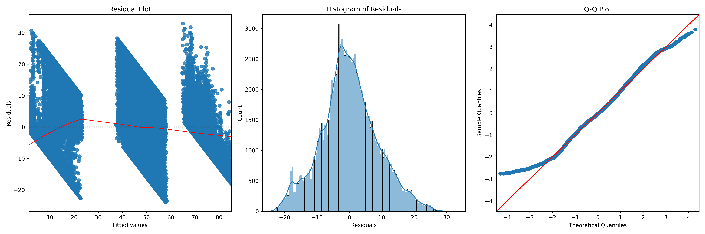

# multinomial-glm-genre-classification
Multinomial GLM for Genre Classification and Feature Analysis

## Project Overview

This project focuses on applying **Generalized Linear Models (GLMs)** to classify genres based on musical features. The study started by exploring data from over 100,000 tracks, analyzing various musical attributes to identify their relationship with genre classification. Through iterative modeling and evaluation, we refined the approach to produce an optimal model for genre prediction, along with feature analysis to better understand the influence of these attributes.

## Key Features

- **Multinomial Logistic Regression**: Used for predicting genres based on a song's features.
- **Generalized Linear Models (GLM)**: Implemented GLMs to study the relationships between song attributes and genre.
- **Error Diagnostics and Leverage Checks**: Performed diagnostic checks to ensure model reliability and handle unusual data points.
- **Visualization**: Generated visual representations to highlight relationships between musical features and genres.

## Abstract

Understanding genre classification has become a crucial task in the modern music industry. This project aims to predict the genre of a track by analyzing various musical features using **Multinomial GLM**. We began by exploring a dataset of over 100,000 tracks, identifying patterns and correlations. The best performing model was selected through careful evaluation, followed by thorough diagnostic checks for errors and outliers. The findings are visualized to help explain the influence of different musical attributes on genre classification, potentially aiding in recommendation systems and other music-related applications.

## Project Structure
```
multinomial-glm-genre-classification/
├── data
│   └── dataset.csv
├── main.py
├── outputs
│   ├── figures
│   └── tables
├── README.md
├── requirement.txt
└── src
    ├── data_preprocessing.py
    ├── exploratory_data_analysis.py
    ├── feature_engineering.py
    ├── glm_processing.py
    ├── __init__.py
    ├── logger.py
    ├── model_evaluation.py
    ├── model_training.py
    └── visualization.py
```

## Installation

```
git clone https://github.com/Suraj-Bhor/multinomial-glm-genre-classification.git
cd multinomial-glm-genre-classification
pip install -r requirements.txt
```

## How to Run
To run the entire pipeline, just execute the main.py script:
```
python main.py
```

When you run the script, the following steps will be executed:

1. **Preprocessing**: The raw dataset is cleaned and preprocessed.
2. **Exploratory Data Analysis (EDA)**: Key features of the data are explored to understand patterns and trends.
3. **Feature Engineering**: New features are created to improve model performance.
4. **GLM Processing**: A Generalized Linear Model (GLM) is applied to the data, with VIF analysis and polynomial terms added where applicable.
5. **Model Training**: Few machine learning models are trained on the featured dataset.
6. **Model Evaluation**: Models are evaluated based on performance metrics.
7. **Visualization**: Results are visualized to help interpretation.

## Output
The results, including model summaries, visualizations, and evaluation metrics, will be saved in the `outputs/` directory:

**Model Summaries**: Detailed GLM summaries and metrics will be stored in text files.
**Figures**: Plots generated during the exploratory data analysis, model evaluation, and feature analysis will be saved in the figures/ subdirectory.
**Tables**: Model evaluation results and VIF values will be stored in the tables/ subdirectory.

## Logging
A log of the entire process will be maintained, providing details about each step in the analysis.

## Acknowledgement
This dataset is taken from the [Kaggle Spopity Dataset](https://www.kaggle.com/datasets/maharshipandya/-spotify-tracks-dataset).

